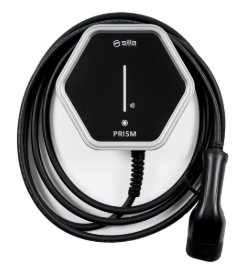
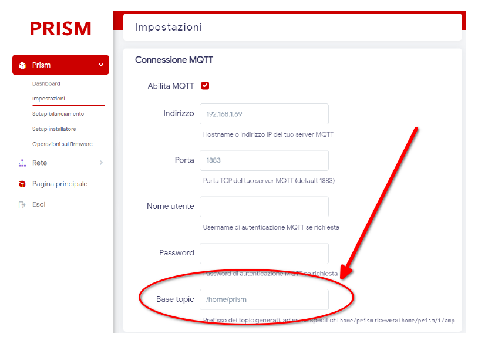
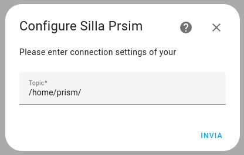
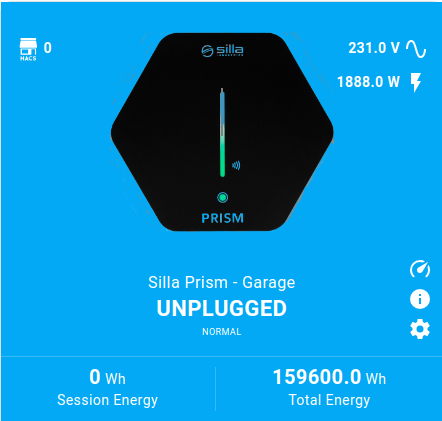

#  # Silla Prism Solar custom integration

**Warning**: This repository is in a early stage. And is not yet stable.



This repository contains a custom integration to integrate a Silla Prism Wallbox inside HomeAssistant

## Installation

Prerequisites: A working MQTT server.

1) Configure the Prism Wallbox to work with your MQTT server  [has shown in manual](https://support.silla.industries/wp-content/uploads/2023/09/DOC-Prism_MQTT_Manual-rel.2.0_rev.-20220105-EN.pdf).
2) Configure and enable the [MQTT integration](https://www.home-assistant.io/integrations/mqtt/) for HomeAssistant
3) Install the custom integration from this repository [](https://my.home-assistant.io/redirect/hacs_repository/?owner=Stefano+Pagnottelli&repository=https%3A%2F%2Fgithub.com%2Fpersuader72%2Fsilla-prism-integration.git&category=integration)

## Usage

1. Add integration Silla Prism using the dashboard  [](https://my.home-assistant.io/redirect/brand/?brand=silla_prism) 

2. Keep note of base path for all Prism topics

   

3. When asked for connection settings set the the base path for all Prism topics. For now it is important to leave a / at the end of the topics as shown in the following picture)
   

   

## Entities

|                                   |              |                                                              |                                        |
| --------------------------------- | ------------ | ------------------------------------------------------------ | -------------------------------------- |
| silla_prism_online                | BinarySensor | Sesnor to find is wallbox is connected or not                |                                        |
| silla_prism_current_state         | Sensor       | Current state of Prism                                       | "idle", "waiting", "charging", "pause" |
| silla_prism_power_grid_voltage    | Sensor       | Measured voltage from grid                                   | V                                      |
| silla_prism_output_power          | Sensor       | Power provided to the charging port                          | W                                      |
| silla_prism_output_current        | Sensor       | Current provided to the charging port                        | mA                                     |
| silla_prism_output_car_current    | Sensor       | Current driven by the car                                    | A                                      |
| silla_prism_current_set_by_user   | Sensor       | Current limit set by user                                    | A                                      |
| silla_prism_session_time          | Sensor       | Duration of the current session                              | s                                      |
| silla_prism_session_output_energy | Sensor       | Energy provided to the charging port during the current session | Wh                                     |
| silla_prism_total_output_energy   | Sensor       | Total energy                                                 | Wh                                     |
| ?/1/error                         | (TODO)       | Error code                                                   |                                        |
| silla_prism_current_port_mode     | Sensor       | Current port mode                                            | solar,normal,paused                    |
| silla_prism_input_grid_power      | Sensor       | Input power from grid                                        | W                                      |
| silla_prism_set_max_current       | Number       | Set the user current limit                                   | A                                      |
| silla_prism_set_current_limit     | Number       | Set the  current limit                                       | A                                      |
| silla_prism_set_mode              | Select       | Set current port mode                                        | solar,normal,paused                    |
| silla_prism_touch_sigle           | BinarySensor | Goes on for 1 second after a single touch gesture            | On,Off                                 |
| silla_prism_touch_double          | BinarySensor | Goes on for 1 second after a double touch gesture            | On,Off                                 |
| silla_prism_touch_long            | BinarySensor | Goes on for 1 second after a long touch gesture              | On,Off                                 |

## Charger Card Integragtion



It's possible to configure the [EV Charger Card](https://github.com/tmjo/charger-card) using the configuration example [provided](https://github.com/persuader72/custom-components/blob/main/charger-card/template.yaml) in this repository 

# Touch button and Automations

This are some example automations for the touch button events

### Start charge after single touch event if the wallbox is in pause state

```yaml
alias: Avvia ricarica dopo pressione pulsante
description: Avvia ricarica dopo pressione pulsante
trigger:
  - platform: state
    entity_id:
      - binary_sensor.silla_prism_touch_sigle
    from: "off"
    to: "on"
condition:
  - condition: state
    entity_id: sensor.silla_prism_current_state
    state: pause
action:
  - service: select.set_option
    data:
      entity_id: select.silla_prism_set_mode
      option: normal
mode: single
```

### Stop charge after single touch event if the wallbox is in charging state

```yaml
alias: Interrompi ricarica dopo pressione pulsante
description: Interrompi ricarica dopo pressione pulsante
trigger:
  - platform: state
    entity_id:
      - binary_sensor.silla_prism_touch_sigle
    from: "off"
    to: "on"
condition:
  - condition: state
    entity_id: sensor.silla_prism_current_state
    state: charging
action:
  - service: select.set_option
    data:
      entity_id: select.silla_prism_set_mode
      option: paused
mode: single
```


## TODO

1. Translations (English)
2. Resolve TODOs in code
