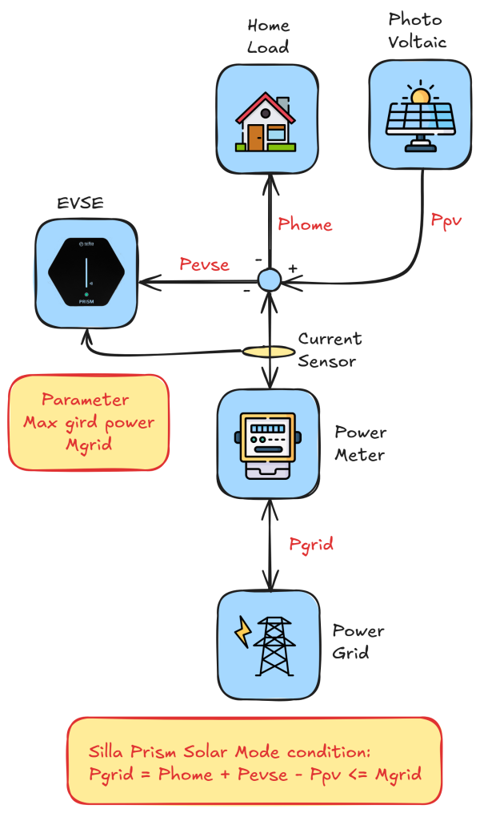

# Solar charging algorithm

| Powers | Descrition                                                   |
| ------ | ------------------------------------------------------------ |
| Phome  | Is the power absorbed by the Home. Is always positive.       |
| Ppv    | Is the power produced by the photovoltaic system is alwais negative |
| Pevse  | Is teh power absorbed by the car us alwais positive          |
| Pgrid  | Is tbe power absorbed or produced by the home. Can be positive is the is home loads (with evse) is greater than the photovoltaic production. Is negative in the  photovoltaic production is greater than the home loads (with evse). |
| Mgrid  | Is a fixed parameter that tell the EVSE to interrupt charging if Pgid is greater than Mgrid. If you are consuming more that Mgrid. |

The following image show the schematic of the system take in account.

The EV charged with a Type2 connector  can't be charged below than **6A** which is **1.3Kw** using a single phase and **3.9Kwh** using three phase.

